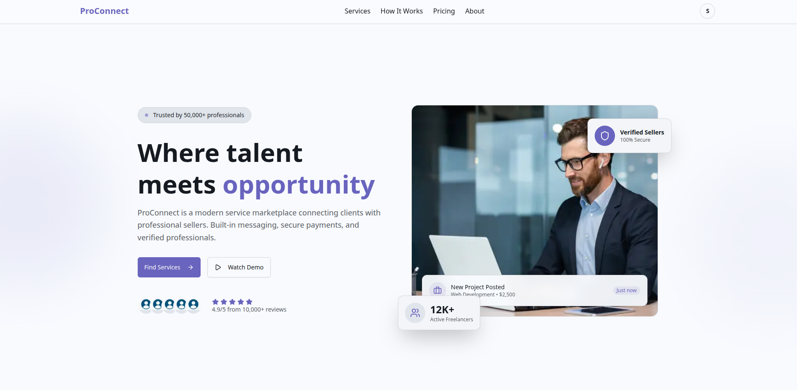

# ✨ ProConnect Frontend



**ProConnect** is a modern marketplace application designed to connect service providers (Sellers) with service seekers (Clients). This repository houses the powerful, responsive, and high-performance **Frontend Application**, built using **Next.js 16 (App Router), TypeScript, and Tailwind CSS**.

We have adopted a modular and role-based architecture, ensuring an optimal user experience for every segment (Admin, Seller, Client).

---

## 🔗 Live Demo and Source Code

| Name | Type | Link |
|------|------|------|
| **Live Application (Frontend)** | Deployment | [https://pro-connect-frontend.vercel.app](https://pro-connect-frontend.vercel.app) |
| **Backend API (Deployment)** | Deployment | [https://pro-connect-backend.vercel.app](https://pro-connect-backend.vercel.app) |
| **Frontend Source** | GitHub | [ProConnect-Frontend](https://github.com/arman-miaa/ProConnect-Frontend) |
| **Backend Source** | GitHub | [ProConnect-Backend](https://github.com/arman-miaa/ProConnect-Backend) |

---

## 🚀 Core Technology Stack

We rely on a modern, performance-oriented tech stack for a robust application:

| Category | Technology | Version | Primary Use Case |
|----------|-----------|---------|------------------|
| **Framework** | Next.js | 16.0.7 | High performance, Server Components, and optimized routing |
| **Language** | TypeScript | 5.9.3 | Codebase reliability and type safety |
| **Styling** | Tailwind CSS | 4.1.17 | Utility-first and rapid responsive design implementation |
| **UI Components** | Shadcn/ui & Radix UI | Latest | Accessible and customizable premium UI components |
| **State Management** | Zustand | 5.0.9 | Simple, fast, and scalable global state management |
| **HTTP Client** | Axios | 1.13.2 | API request handling |
| **Data Validation** | Zod | 4.1.13 | Data input and schema validation across the app |
| **Charts & Icons** | Recharts & Lucide React | 3.5.1 & 0.546.0 | Data visualization and icon management |
| **Notifications** | Sonner & SweetAlert2 | Latest | User feedback and alerts |
| **Animations** | Framer Motion | 12.23.25 | Smooth UI transitions and interactions |

---

## ✨ Key Application Features

### 1. Public Web and Marketing Sections (`(commonLayout)`)

Your public pages are detailed and designed to engage users:

**Homepage (`/`):**
- **Hero Section:** Prominent display of the core value proposition with a call-to-action
- **Features Section:** Highlighting the main benefits and functionalities of the platform
- **Stats Section:** Displaying key platform metrics (e.g., successful orders, user count)
- **Testimonials:** Showcasing positive reviews from clients
- **CTA Section:** Final call-to-action to encourage user registration

**Service Browsing:** Pages for viewing all available services and drilling down into specific service details (`/services` and `/services/[id]`)

**Authentication Flow:** Secure screens for Login, Registration, Forget Password, and Reset Password

**Payment Status:** Dedicated, styled pages to display success (`/payment/success`), failure (`/payment/fail`), or cancellation (`/payment/cancel`) messages after interacting with the payment gateway

### 2. Role-Based Protected Dashboards (`(dashboardLayout)`)

The application offers three robust dashboards, secured by role-based access control:

| User Role | Dashboard Module | Core Functionality |
|-----------|-----------------|-------------------|
| **Admin** | `/admin/dashboard` | Management of Users, Admins, and Sellers; Analytics with Revenue/Order Charts, Transactions, and Message/Report oversight |
| **Seller** | `/seller/dashboard` | Service creation and management, Earnings overview, Payment History, and viewing service reviews |
| **Client** | `/client/dashboard` | Tracking orders, Transaction History, and submitting service reviews |
| **General Protected** | `/my-profile`, `/change-password` | Viewing and editing profile information, and updating user password |

---

## 📂 Project Structure

We maintain a clear and maintainable codebase structure based on feature domains:

```
src/
├── app/                        # Next.js App Router
│   ├── (commonLayout)/         # Public Pages and Auth Routes
│   ├── (dashboardLayout)/      # Protected Pages (Role-based Dashboards)
│   ├── api/                    # Next.js API Routes
│   └── globals.css             # Global Styles
├── assets/                     # Icons, Images, and Static Media
├── components/                 # UI Components
│   ├── auth/                   # Authentication Forms and Logic
│   ├── modules/                # Large, feature-specific components
│   ├── shared/                 # Navbar, Footers, Filters, Loaders
│   └── ui/                     # Shadcn/ui Primitives
├── hooks/                      # Custom React Hooks
├── lib/                        # Core Utilities and Helpers
├── services/                   # Dedicated API Call Functions
├── types/                      # TypeScript Interfaces
└── zod/                        # Zod Validation Schemas
```

---

## ⚙️ Local Setup Guide

Follow these steps to get the project running on your local machine:

### Prerequisites

Ensure you have the following installed on your system:
- Node.js (v18 or higher)
- pnpm (recommended) or npm

### 1. Installation

```bash
# Clone the repository
git clone https://github.com/arman-miaa/ProConnect-Frontend.git

# Navigate into the project directory
cd ProConnect-Frontend

# Install dependencies using pnpm
pnpm install
```

### 2. Environment Variable Setup

Create a `.env.local` file in the root directory of the project and add the base URL for your backend API:

```bash
# .env.local
NEXT_PUBLIC_API_BASE_URL="https://pro-connect-backend.vercel.app/api/v1"
```

### 3. Running the Project

To start the application in development mode:

```bash
pnpm run dev
```

Access the application at: [http://localhost:3000](http://localhost:3000)

### Available Scripts

```bash
# Development server
pnpm run dev

# Production build
pnpm run build

# Start production server
pnpm start

# Run linter
pnpm run lint
```

---

## 🛠️ Key Dependencies Overview

### Core Dependencies

**Next.js & React:** The foundation of the application providing server-side rendering and React 19 with latest features.

**TypeScript:** Provides type safety and better developer experience across the entire codebase.

**Tailwind CSS:** Utility-first CSS framework for rapid and responsive UI development.

**Radix UI & Shadcn/ui:** Provides accessible, unstyled, and customizable UI components built on top of Radix UI primitives.

**Zustand:** Lightweight state management solution for managing global application state.

**Axios:** Promise-based HTTP client for making API requests to the backend.

**Zod:** TypeScript-first schema validation with static type inference, used for form validation and API data validation.

**Recharts:** Composable charting library for data visualization in admin dashboards.

**Lucide React:** Beautiful, consistent icon library with React components.

**Framer Motion:** Production-ready animation library for creating smooth transitions and interactions.

**Sonner & SweetAlert2:** User-friendly notification and alert components.

---

## 🤝 Contributing

We welcome contributions! Please feel free to submit a Pull Request for any bug fixes, improvements, or new features.

1. Ensure your changes are organized with clear commit messages (e.g., `feat: Implement secure seller service creation modal`)
2. Open a new Pull Request against the main branch
3. Provide a detailed description of your changes

---

## 👤 Author

**Arman Mia**

- GitHub: [arman-miaa](https://github.com/arman-miaa)


---

## 📄 License

This project is licensed under the **ISC License**.